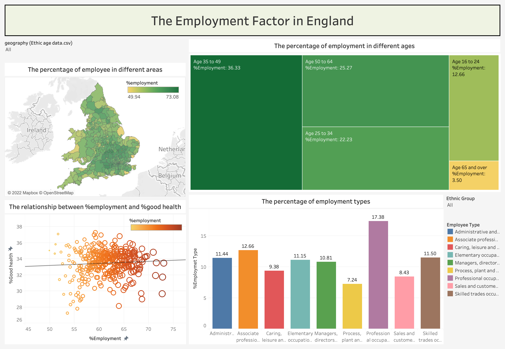

# Data Visualization

This repository contains two data visualization projects using Tableau. The first project used the [nomis dataset](https://www.nomisweb.co.uk/) which provides statistical data related to the population, society and the labour market at national, regional and local levels on the UK. Moreover, it applied the data projection. The another project included [bulk bookstore dataset](https://www.kaggle.com/datasets/yamqwe/bulk-bookstore-dataset) which contains prices and other information about approximately 1000 books. More detail can find as the following:

# nomis-data 

This project provides data preparation using Tableau Prep, data visualisation by Tableau and data projection using PCA as well as UMAP. Working with [the nomis dataset](https://www.nomisweb.co.uk/) combines the statistical data in the UK including population, society, and region. 

The goal of this project aims to design and build an analysis complicated dataset that addresses the issue of soci-oeconomic life in England. It explores different factors including the ethnic group, the different age groups, the economic activities and the general health in order to investigate the effect on between those factors.

The first step was pre-processing data with Tableau Prep before visualizing it with Tableau. This was followed by applying the PAC and UMAP.

**The example of dashboard**

